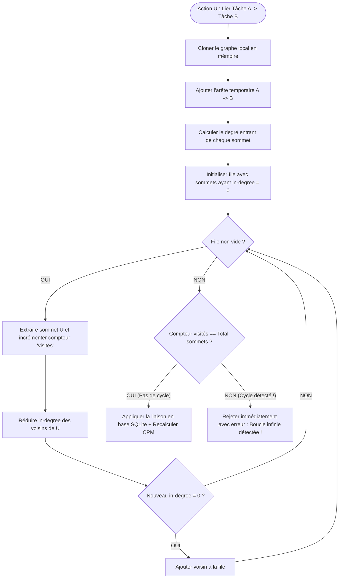
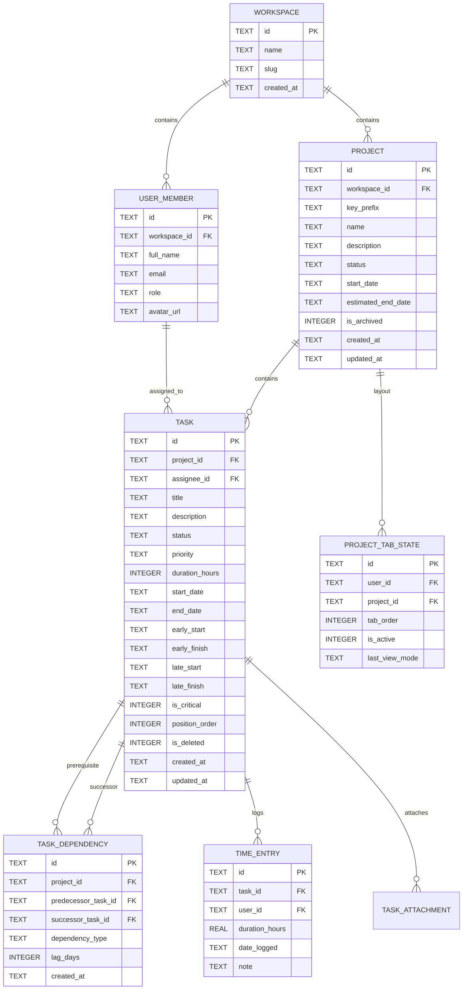
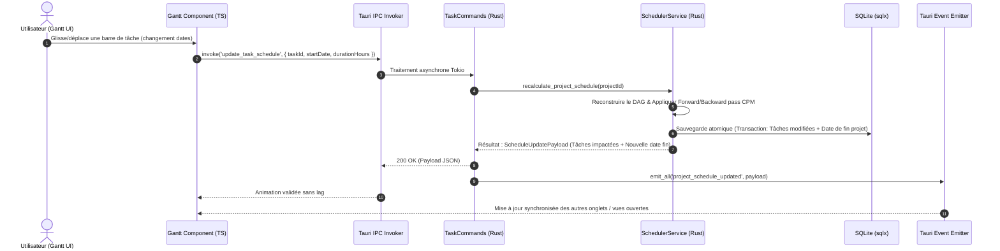

# ARCHITECTURE TECHNIQUE GLOBALE : APPLICATION DE GESTION DE PROJETS (PM)

---

## 1. INTRODUCTION & DÉCISIONS D'ARCHITECTURE (ADR)

### 1.1 Contexte & Objectifs Techniques
L'application **PM** est un logiciel desktop moderne, ultra-rapide et autonome de gestion de projets, planification temporelle et suivi d'intervenants. Elle doit garantir :
- Une **réactivité native** (60 FPS constants) sur les vues interactives complexes (Gantt, Calendrier, Kanban).
- Un **calcul dynamique et temps réel** des dates de fin prévisionnelles et du chemin critique via un moteur de graphe sans cycle (DAG).
- Une **persistance locale robuste et ACID** via SQLite sans dépendance à un serveur cloud obligatoire.
- Une **architecture modulaire et extensible** (Clean Architecture / Hexagonale) en Rust.

### 1.2 Tableau des Décisions Architecturales Clés

| Composant / Couche | Technologie Retenue | Justification & Rationale |
| :--- | :--- | :--- |
| **Core / Backend** | **Rust (édition 2021+)** | Performance brute, sécurité mémoire à la compilation, concurrence sans data-race, typage strict. |
| **Framework GUI** | **Tauri v2** | Binaire ultra-léger (< 15 Mo), consommation mémoire minimale (~30-50 Mo vs > 300 Mo pour Electron), sécurité IPC durcie. |
| **Moteur Rendu Gantt/UI** | **TypeScript + SolidJS / React + Canvas/SVG** | Rendu granulaire ultra-rapide sans surcharge DOM, virtualisation des listes de tâches, tracé vectoriel fluide des dépendances. |
| **Base de données** | **SQLite 3 (via `sqlx`)** | Embarquée, zéro-configuration, requêtes vérifiées au compile-time (`sqlx compile-time query verification`), transactions ACID. |
| **Moteur Algorithmique** | **Module Rust dédié (`pm-engine`)** | Algorithmes de graphes purs : Kahn (tri topologique), CPM (Critical Path Method), détection de cycles en $O(V + E)$. |
| **Concurrence & Async** | **Tokio Runtime** | Gestion asynchrone des I/O fichiers, SQLite pool et événements IPC. |

---

## 2. ARCHITECTURE SYSTÈME & MODÈLE EN COUCHES

L'application suit les principes de la **Clean Architecture** (Architecture en Oignon), garantissant l'indépendance totale du moteur métier vis-à-vis de l'interface graphique et de la base de données.

```mermaid
graph TD
    subgraph FRONTEND [Frontend UI - Webview Tauri]
        UI_VIEWS[Vues: Gantt, Kanban, Calendrier, Onglets Multi-projets]
        UI_STORE[State Management Réactif / Store local]
        UI_CANVAS[Moteur de rendu Canvas/SVG pour les liens de dépendance]
        UI_IPC_CLIENT[Tauri IPC Bridge / `@tauri-apps/api`]
    end

    subgraph TAURI_BRIDGE [Couche d'Interfaçage & Commandes]
        CMD_ROUTER[Tauri Commands Handlers]
        STATE_MGR[App State Manager - Tauri Managed State]
        EVENT_BUS[Event Emitter - WebSocket-like local events]
    end

    subgraph DOMAIN_CORE [Cœur de Domaine & Algorithmes (Pure Rust)]
        GRAPH_ENGINE[Moteur de Graphe DAG & Tri Topologique]
        CPM_ENGINE[Moteur Critical Path Method / Calcul Date de Fin]
        VALIDATOR[Validateur de Règles Métiers & Contraintes]
        MODELS[Entités: Project, Task, Dependency, Member]
    end

    subgraph SERVICES_APP [Couche Application & Cas d'Utilisation]
        PRJ_SERVICE[ProjectService]
        TASK_SERVICE[TaskService]
        SCHED_SERVICE[SchedulerService]
        MEMBER_SERVICE[MemberService]
    end

    subgraph PERSISTENCE [Couche Persistance & Données]
        SQLX_POOL[SQLx SQLite Connection Pool]
        MIGRATIONS[Embedded Migrations Engine]
        REPOSITORIES[Repositories SQL: TaskRepo, ProjectRepo, etc.]
        SQLITE_DB[(Base Locale SQLite / .pm_data.db)]
    end

    UI_VIEWS --> UI_STORE
    UI_STORE --> UI_CANVAS
    UI_STORE --> UI_IPC_CLIENT
    UI_IPC_CLIENT <==>|IPC binaire sérialisé JSON/MessagePack| CMD_ROUTER
    CMD_ROUTER --> STATE_MGR
    CMD_ROUTER --> SERVICES_APP
    SERVICES_APP --> DOMAIN_CORE
    SERVICES_APP --> REPOSITORIES
    REPOSITORIES --> SQLX_POOL
    SQLX_POOL --> SQLITE_DB
    STATE_MGR --> EVENT_BUS
    EVENT_BUS -.->|Events asynchrones UI| UI_IPC_CLIENT
```

---

## 3. MOTEUR ALGORITHMIQUE DE GRAPHE & CALCUL DE PLANNING (CPM)

### 3.1 Modélisation Mathématique
L'ensemble des tâches d'un projet forme un graphe orienté $G = (V, E)$ où :
- $V = \{T_1, T_2, \dots, T_n\}$ représente l'ensemble des tâches (sommets). Chaque tâche possède une durée estimée $d(T) \ge 0$.
- $E \subseteq V \times V$ représente les dépendances d'antériorité (arêtes orientées). Une arête $(A, B) \in E$ signifie : *la tâche A doit être terminée avant que la tâche B ne puisse démarrer* ($FS$ - Finish to Start).

### 3.2 Détection de Cycles & Validation Préventive (Algorithme de Kahn)
À chaque tentative d'ajout ou de modification de dépendance $(A \to B)$, le moteur effectue une validation instantanée en mémoire :



### 3.3 Algorithme du Chemin Critique (Critical Path Method - CPM)
Le moteur calcule dynamiquement les dates clés et la date de fin estimée du projet :

1. **Parcours Avant (Forward Pass) :** Calcul des dates au plus tôt
   $$ES(B) = \max_{(A, B) \in E} (EF(A)) \quad \text{avec} \quad EF(T) = ES(T) + d(T)$$
   - *Date de Fin Estimée du Projet* : $T_{\text{fin\_projet}} = \max_{T \in V} (EF(T))$

2. **Parcours Arrière (Backward Pass) :** Calcul des dates au plus tard
   $$LF(A) = \min_{(A, B) \in E} (LS(B)) \quad \text{avec} \quad LS(T) = LF(T) - d(T)$$

3. **Marges & Chemin Critique :**
   - Marge Totale : $M_T(T) = LS(T) - ES(T) = LF(T) - EF(T)$
   - **Chemin Critique :** Ensemble des tâches dont $M_T(T) = 0$. Tout retard sur ces tâches reporte directement la date de fin globale du projet.

---

## 4. SCHÉMA RELATIONNEL DE LA BASE DE DONNÉES (SQLITE)



### 4.1 Définition DDL Complète (Extrait SQL)
```sql
-- Active les contraintes de clés étrangères
PRAGMA foreign_keys = ON;
PRAGMA journal_mode = WAL;

-- Table des Projets
CREATE TABLE IF NOT EXISTS projects (
    id TEXT PRIMARY KEY NOT NULL,
    workspace_id TEXT NOT NULL DEFAULT 'default-ws',
    key_prefix TEXT NOT NULL UNIQUE,
    name TEXT NOT NULL,
    description TEXT,
    status TEXT NOT NULL DEFAULT 'ACTIVE', -- ACTIVE, COMPLETED, ARCHIVED
    start_date TEXT NOT NULL,
    estimated_end_date TEXT,
    is_archived INTEGER NOT NULL DEFAULT 0,
    created_at TEXT NOT NULL DEFAULT (datetime('now')),
    updated_at TEXT NOT NULL DEFAULT (datetime('now'))
);

-- Table des Intervenants / Membres
CREATE TABLE IF NOT EXISTS user_members (
    id TEXT PRIMARY KEY NOT NULL,
    workspace_id TEXT NOT NULL,
    full_name TEXT NOT NULL,
    email TEXT NOT NULL UNIQUE,
    role TEXT NOT NULL DEFAULT 'MEMBER',
    avatar_url TEXT,
    created_at TEXT NOT NULL DEFAULT (datetime('now'))
);

-- Table des Tâches
CREATE TABLE IF NOT EXISTS tasks (
    id TEXT PRIMARY KEY NOT NULL,
    project_id TEXT NOT NULL REFERENCES projects(id) ON DELETE CASCADE,
    assignee_id TEXT REFERENCES user_members(id) ON DELETE SET NULL,
    title TEXT NOT NULL,
    description TEXT,
    status TEXT NOT NULL DEFAULT 'TODO', -- TODO, IN_PROGRESS, REVIEW, DONE, BLOCKED
    priority TEXT NOT NULL DEFAULT 'NORMAL', -- LOW, NORMAL, HIGH, URGENT
    duration_hours INTEGER NOT NULL DEFAULT 8,
    start_date TEXT NOT NULL,
    end_date TEXT NOT NULL,
    early_start TEXT,
    early_finish TEXT,
    late_start TEXT,
    late_finish TEXT,
    is_critical INTEGER NOT NULL DEFAULT 0,
    position_order INTEGER NOT NULL DEFAULT 0,
    is_deleted INTEGER NOT NULL DEFAULT 0,
    created_at TEXT NOT NULL DEFAULT (datetime('now')),
    updated_at TEXT NOT NULL DEFAULT (datetime('now'))
);

-- Table des Dépendances entre Tâches
CREATE TABLE IF NOT EXISTS task_dependencies (
    id TEXT PRIMARY KEY NOT NULL,
    project_id TEXT NOT NULL REFERENCES projects(id) ON DELETE CASCADE,
    predecessor_task_id TEXT NOT NULL REFERENCES tasks(id) ON DELETE CASCADE,
    successor_task_id TEXT NOT NULL REFERENCES tasks(id) ON DELETE CASCADE,
    dependency_type TEXT NOT NULL DEFAULT 'FS', -- Finish-to-Start (FS), Start-to-Start (SS)
    lag_days INTEGER NOT NULL DEFAULT 0,
    created_at TEXT NOT NULL DEFAULT (datetime('now')),
    CONSTRAINT uq_task_link UNIQUE(predecessor_task_id, successor_task_id),
    CONSTRAINT chk_no_self_loop CHECK(predecessor_task_id != successor_task_id)
);

-- Index d'optimisation
CREATE INDEX IF NOT EXISTS idx_tasks_project ON tasks(project_id, is_deleted);
CREATE INDEX IF NOT EXISTS idx_tasks_assignee ON tasks(assignee_id);
CREATE INDEX IF NOT EXISTS idx_dep_pred ON task_dependencies(predecessor_task_id);
CREATE INDEX IF NOT EXISTS idx_dep_succ ON task_dependencies(successor_task_id);
```

---

## 5. COUCHE IPC & GESTION DES COMMANDES TAURI

L'interfaçage entre le Frontend (Typescript) et le Backend (Rust) repose sur des commandes typées et sérialisées :



### 5.1 Contrats d'API IPC Principaux
```rust
// Extrait des signatures de commandes exposées à l'UI
#[tauri::command]
pub async fn get_project_full_graph(
    project_id: String,
    state: tauri::State<'_, AppState>
) -> Result<ProjectGraphPayload, AppError>;

#[tauri::command]
pub async fn create_task_dependency(
    predecessor_id: String,
    successor_id: String,
    state: tauri::State<'_, AppState>
) -> Result<ScheduleUpdatePayload, AppError>;

#[tauri::command]
pub async fn update_task_schedule(
    task_id: String,
    start_date: String,
    duration_hours: i32,
    state: tauri::State<'_, AppState>
) -> Result<ScheduleUpdatePayload, AppError>;

#[tauri::command]
pub async fn save_tab_workspace_state(
    active_tab_id: String,
    opened_project_ids: Vec<String>,
    state: tauri::State<'_, AppState>
) -> Result<(), AppError>;
```

---

## 6. MOTEUR DE RENDU DU DIAGRAMME DE GANTT & FLUIDITÉ 60 FPS

Pour garantir une expérience sans ralentissement même avec des centaines de tâches :

1. **Virtualisation de Liste Horizontale & Verticale :** Seules les lignes visibles à l'écran (viewport) et les colonnes temporelles actives sont rendues dans le DOM.
2. **Couche Dépendances Vectorielle (SVG Overlay / Canvas 2D) :**
   - Les flèches de liaison entre tâches utilisent des **courbes de Bézier cubiques** calculées en coordonnées directes de nœud à nœud.
   - Les lignes du **chemin critique** sont surlignées en rouge dynamique avec un effet lumineux pour une lisibilité immédiate.
3. **Optimistic UI Updates :** Lors du drag & drop, la position visuelle est modifiée instantanément côté UI pendant que le calcul CPM et la validation SQL s'exécutent en arrière-plan.

---

## 7. GESTION DU MULTI-ONGLETS & NAVIGATION INTERACTIVE

- **Système d'Onglets Persistant :** L'utilisateur peut ouvrir plusieurs projets simultanément (1 projet par onglet + 1 onglet "Vue Globale Portfolio").
- **Mémorisation de l'État :** La position des onglets ouverts, la vue active (Gantt, Calendrier, Kanban) et le niveau de zoom temporel sont enregistrés en base SQLite à chaque changement et restaurés instantanément au démarrage de l'application.
- **Menus Contextuels (Right-Click Native UI) :** Menu rapide sur les cartes et barres de tâches (Assigner, Changer statut, Lier à une tâche, Dupliquer, Supprimer/Archiver).

---

## 8. STRUCTURE DU PROJET & ORGANISATION DES RÉPERTOIRES

```
PM/
├── Cargo.toml                      # Workspace Rust principal
├── src-tauri/                      # Backend Rust & Intégration Tauri
│   ├── Cargo.toml
│   ├── tauri.conf.json             # Configuration fenêtres, permissions, plugins
│   ├── migrations/                 # Scripts SQL de migration sqlx
│   │   ├── 0001_init_schema.sql
│   │   └── 0002_add_cpm_indices.sql
│   └── src/
│       ├── main.rs                 # Point d'entrée binaire Desktop
│       ├── app_state.rs            # Struct AppState (Db pool, bus d'événements)
│       ├── errors.rs               # Gestion unifiée des erreurs (thiserror)
│       ├── commands/               # Contrôleurs de commandes Tauri IPC
│       │   ├── project_commands.rs
│       │   ├── task_commands.rs
│       │   ├── dependency_commands.rs
│       │   └── tab_commands.rs
│       ├── domain/                 # Entités et logique métier pure
│       │   ├── models/
│       │   └── graph/              # Moteur de graphe, Kahn DAG, CPM
│       │       ├── dag.rs
│       │       ├── cpm.rs
│       │       └── cycle_detector.rs
│       ├── services/               # Services applicatifs
│       │   ├── project_service.rs
│       │   ├── task_service.rs
│       │   └── scheduler_service.rs
│       └── repositories/           # Accès aux données SQLite (sqlx)
│           ├── project_repo.rs
│           ├── task_repo.rs
│           └── dependency_repo.rs
├── src/                            # Frontend UI
│   ├── index.html
│   ├── App.tsx                     # Layout global & barre d'onglets
│   ├── components/
│   │   ├── gantt/                  # Moteur Gantt (Canvas/SVG + Virtual timeline)
│   │   ├── kanban/                 # Vue Kanban avec Drag & Drop bidirectionnel
│   │   ├── calendar/               # Vue Calendrier chronologique
│   │   ├── tabs/                   # Gestionnaire d'onglets multi-projets
│   │   ├── modals/                 # Modales d'édition complète (Projet, Tâche, Membre)
│   │   └── context_menu/           # Menus contextuels clic droit
│   ├── stores/                     # State management réactif
│   ├── hooks/                      # Hooks IPC Tauri
│   └── styles/                     # Thèmes CSS modernes (Dark/Light mode)
├── specificationfonctionel.md      # Spécifications fonctionnelles complètes
├── CDC.md                          # Cahier des charges initial
└── archi.md                        # Ce document d'architecture technique
```

---

## 9. CONCLUSION & PROCHAINES ÉTAPES D'IMPLÉMENTATION

Cette architecture garantit la conformité totale avec les contraintes du cahier des charges :
1. ✅ **Performance & Robustesse :** Rust + SQLite `sqlx` + Tauri v2.
2. ✅ **Algorithmique Avancée :** Détection de cycle (Kahn) et calcul dynamique de la date de fin estimée du projet (CPM) intégrés au cœur du moteur.
3. ✅ **Expérience Utilisateur :** Multi-onglets, synchronisation instantanée des vues Gantt/Calendrier/Kanban et édition graphique totale.
