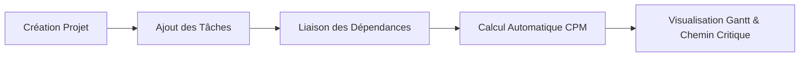

# 📘 MANUEL D'UTILISATION : PLATEFORME PM

---

## 1. BIENVENUE & PRISE EN MAIN RAPIDE

### 1.1 Présentation de l'Application
**PM** est une application desktop moderne et ultra-rapide de gestion de projets et de planification temporelle. Dotée d'un moteur de calcul de graphe et de la **méthode du chemin critique (CPM)**, elle vous permet d'anticiper la date de livraison de vos projets, de tracer visuellement les dépendances entre vos tâches et d'équilibrer la charge de travail de vos équipes.



### 1.2 Lancement de l'Application
Pour démarrer l'application :
- **Depuis un terminal :**
  ```bash
  cargo run --release
  ```
- **Depuis l'exécutable binaire :** Double-cliquez simplement sur le fichier `pm` (ou `pm.exe`).
- Les données sont automatiquement enregistrées en temps réel dans votre base SQLite locale `pm_data.db`.

---

## 2. DÉCOUVERTE DE L'INTERFACE UTILISATEUR

L'interface de PM est divisée en 3 zones ergonomiques :

```
┌─────────────────────────────────────────────────────────────────────────────┐
│ 🦀 PM   [📁 ALPHA] [📁 BETA]  [+ Nouveau Projet]     ⏳ Fin estimée: 28/10  │ <- 1. TOP BAR & ONGLETS
├─────────────────────────────────────────────────────────────────────────────┤
│ [📊 Gantt] [📋 Kanban] [📅 Planning] [👥 Intervenants]    [+ Nouvelle Tâche]│ <- 2. SÉLECTEUR DE VUES
├─────────────────────────────────────────────────────────────────────────────┤
│                                                                             │
│                        ZONE CENTRALE D'AFFICHAGE                           │
│               (Diagramme de Gantt, Tableau Kanban ou Planning)             │
│                                                                             │
└─────────────────────────────────────────────────────────────────────────────┘
```

1. **Barre Supérieure (Top Bar) :**
   - **Système d'onglets :** Permet de basculer instantanément d'un projet à un autre sans recharger l'application.
   - **Bouton `+ Nouveau Projet` :** Ouvre l'assistant de création d'un nouvel espace projet.
   - **Indicateur de Fin Estimée :** Affiche en direct la date d'achèvement calculée par le moteur CPM ainsi que la durée totale en jours.
2. **Barre de Navigation des Vues :**
   - Permet d'alterner entre les vues : **Gantt**, **Kanban**, **Planning** et **Intervenants**.
   - Bouton d'action rapide `+ Nouvelle Tâche` et `✏️ Modifier Tâche`.
3. **Zone Principale :** Restitution graphique haute performance à 60 FPS.

---

## 3. GESTION DES PROJETS & ONGLETS

### 3.1 Créer un Nouveau Projet
1. Cliquez sur le bouton **`+ Nouveau Projet`** en haut à gauche.
2. Remplissez le formulaire :
   - **Clé unique (ex: `PRJ`, `ALPHA`) :** Préfixe court servant d'identifiant.
   - **Nom du projet :** Titre clair de votre initiative.
   - **Date de début :** Date de lancement effectif des travaux (`YYYY-MM-DD`).
   - **Description :** Contexte et objectifs du projet.
3. Cliquez sur **`💾 Enregistrer`**. Le projet s'ouvre immédiatement dans un nouvel onglet.

### 3.2 Navigation Multi-Projets
- Cliquez sur n'importe quel onglet `📁 [CLÉ] Nom du Projet` pour afficher ses données.
- Vos données, l'onglet actif et vos tâches sont conservés automatiquement à la fermeture.

---

## 4. PLANIFICATION AVANCÉE & DIAGRAMME DE GANTT

La vue **Gantt & Dépendances** est le cœur de pilotage de l'application.

```mermaid
flowchart LR
    T1[Tâche 1 : Cadrage (2j)] -->|Courbe de Bézier| T2[Tâche 2 : Dév Core (4j)]
    T2 -->|Courbe de Bézier| T3[Tâche 3 : UI Gantt (3j)]
    T3 -->|Chemin Critique Rouge| T4[Tâche 4 : Recette & Déploiement (2j)]
```

### 4.1 Lecture du Diagramme de Gantt
- **Axe horizontal :** Représente les jours ouvrés ($J1, J2, J3\dots$) et les dates réelles associées.
- **Barres horizontales :** Représentent la durée des tâches (calculée à raison de 8 heures par jour ouvré).
- **Couleur des barres :**
  - 🔵 **Bleu :** Tâche normale planifiée.
  - 🔴 **Rouge :** Tâche appartenant au **Chemin Critique** (aucun retard toléré).
  - 🟢 **Vert :** Tâche terminée.

### 4.2 Création et Visualisation des Dépendances
- Les liaisons entre tâches sont matérialisées par des **courbes de Bézier cubiques** avec pointes de flèches orientées vers la tâche successeur.
- Si une tâche est retardée, toutes ses tâches successeurs sont automatiquement recalculées et décalées dans le temps.
- **Mise en avant du Chemin Critique :** Les liens et les tâches critiques sont tracés en rouge vif. Un retard sur une seule de ces tâches retarde immédiatement la date de fin globale du projet.

### 4.3 Interactions Rapides sur le Gantt
- **Sélection simple :** Cliquez sur une barre ou une ligne pour la sélectionner.
- **Édition rapide :** **Double-cliquez** sur une tâche pour ouvrir sa modale d'édition.

---

## 5. GESTION DES TÂCHES & AUTRES VUES

### 5.1 Créer ou Modifier une Tâche
Cliquez sur **`+ Nouvelle Tâche`** ou double-cliquez sur une tâche existante :
- **Titre & Description :** Objet de l'activité.
- **Durée estimée (heures) :** Nombre d'heures prévues (l'équivalent en jours est calculé automatiquement).
- **Priorité :** *Basse*, *Normale*, *Haute*, *Urgente*.
- **Statut :** *À faire*, *En cours*, *En revue / QA*, *Terminé*, *Bloqué*.
- **Intervenant assigné :** Sélection du collaborateur responsable.
- **Dépendance (Doit suivre) :** Choisissez la tâche qui doit être terminée avant de démarrer celle-ci.
- **Suppression :** Le bouton **`🗑 Supprimer`** place la tâche dans la corbeille et met à jour l'ordonnancement.

---

### 5.2 Vue Tableau Kanban
La vue **Tableau Kanban** permet de suivre le cycle de vie opérationnel :
- **4 Colonnes :** *À FAIRE*, *EN COURS*, *EN REVUE / QA*, *TERMINÉ*.
- Chaque carte indique le titre, la durée, l'intervenant, la priorité et l'indicateur **`● CRITIQUE`** le cas échéant.
- **Changement de statut rapide :** Utilisez le menu déroulant sur chaque carte pour déplacer instantanément un ticket d'une colonne à une autre.

---

### 5.3 Vue Planning Chronologique
La vue **Planning** classe les tâches par ordre chronologique strict de début au plus tôt ($Early Start$), idéal pour savoir exactement quelles activités démarrer aujourd'hui.

---

### 5.4 Vue Intervenants & Équipe
Consultez la liste des membres enregistrés dans le workspace, leurs coordonnées et leurs rôles.

---

## 6. MOTEUR ALGORITHMIQUE & SÉCURITÉ DE PLANIFICATION

### 6.1 Détection Préventive des Boucles Infinies (Cycles)
Le moteur de graphe de PM intègre une sécurité mathématique absolue (Algorithme de Kahn) :
- Si vous tentez de créer une dépendance circulaire (ex: $A \to B \to C \to A$), l'application **bloque immédiatement l'action** et affiche un message explicatif :
  > ⚠️ **Opération non autorisée par le moteur de graphe :**  
  > *Cycle de dépendance détecté entre la tâche 'C' et la tâche 'A'.*

### 6.2 Recalcul Dynamique Transparent
Chaque ajout, modification de durée ou suppression déclenche un recalcul sous 1 milliseconde :
1. Calcul des dates au plus tôt ($ES, EF$).
2. Calcul des dates au plus tard ($LS, LF$).
3. Mise à jour de la date de livraison estimée du projet.

---

## 7. GESTION DES DONNÉES & SAUVEGARDE

- Toutes vos données sont stockées localement dans le fichier **`pm_data.db`** (au format standard SQLite).
- **Sauvegarde simple :** Pour sauvegarder l'intégralité de votre travail, copiez simplement le fichier `pm_data.db` sur une clé USB ou un disque externe.
- **Restauration :** Remplacez le fichier `pm_data.db` par votre copie de sauvegarde.

---

## 8. FOIRE AUX QUESTIONS (FAQ)

| Question | Réponse |
| :--- | :--- |
| **Puis-je utiliser l'application sans connexion Internet ?** | **Oui, à 100%.** L'application est totalement autonome et fonctionne sans aucun serveur distant. |
| **Pourquoi ma tâche apparaît-elle en rouge dans le Gantt ?** | Elle fait partie du **Chemin Critique**. Tout retard sur cette tâche reportera d'autant la date de fin finale du projet. |
| **Comment modifier la date de début d'une tâche dépendante ?** | La date de début d'une tâche dépendante est calculée automatiquement pour commencer dès que ses tâches antérieures sont terminées. |
| **Comment supprimer un projet ?** | Ouvrez le projet et utilisez l'option d'archivage ou de suppression dans les paramètres de gestion. |
