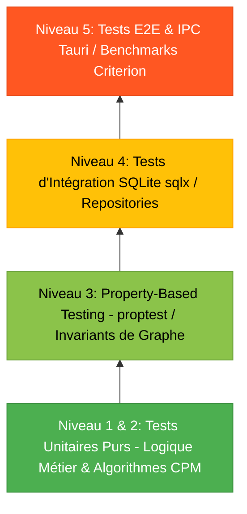

# NORME DE DÉVELOPPEMENT & D'INGÉNIERIE QUALITÉ BASÉE SUR LES TESTS (TDD) EN RUST

---

## 1. VISION & PRINCIPES FONDAMENTAUX

### 1.1 Objectif
Ce document définit les standards de développement, de conception logicielle et d'assurance qualité applicables à l'ensemble du code Rust de la plateforme **PM**. Le respect de cette norme est obligatoire pour garantir :
- La **fiabilité absolue** du moteur de graphe et du calcul de planning (zéro bug de calcul, zéro boucle infinie).
- La **sécurité mémoire et la robustesse** (zéro panic ou crash en production).
- La **maintenabilité** à long terme grâce à une couverture de tests automatisés exhaustive et déterministe.

### 1.2 Principes Directeurs
1. **Test-Driven Development (TDD) :** Tout développement de fonctionnalité ou correction de bug commence obligatoirement par l'écriture du test qui échoue (*Red*), suivi du code minimal pour le faire passer (*Green*), puis du remaniement de l'architecture (*Refactor*).
2. **Make Illegal States Unrepresentable :** Exploiter le système de types de Rust (Newtypes, Enums, Typestate Pattern) pour rendre impossibles les états incohérents dès la compilation.
3. **Zéro `unwrap()` / `expect()` en Production :** L'usage de `.unwrap()` ou `.expect()` est **strictement interdit** en dehors des blocs `#[cfg(test)]`. Toute erreur doit être propagée via `Result<T, E>` avec `thiserror`.
4. **Immutabilité par Défaut :** Préférer les structures de données immutables et les fonctions pures pour la logique métier et les calculs algorithmiques.

---

## 2. PYRAMIDE DES TESTS & STRATÉGIE DE TEST



### 2.1 Répartition & Exigences de Couverture

| Niveau de Test | Périmètre | Outils Retenus | Seuil de Couverture Requis |
| :--- | :--- | :--- | :---: |
| **Tests Unitaires** | Algorithmes CPM, DAG, calculs de marges, parseurs, validateurs | `cargo test`, `pretty_assertions` | **100%** sur le moteur de graphe |
| **Property-Based Testing** | Invariants mathématiques, absence de cycles, fuzzing de graphes | `proptest` | Validation sur $10\,000$ graphes aléatoires |
| **Tests d'Intégration** | Base SQLite, migrations, transactions, contraintes de clés | `sqlx::test`, SQLite in-memory | **$\ge 90\%$** sur les repositories |
| **Tests IPC / Services** | Commandes Tauri, flux complets, gestion d'erreurs | Tauri Test Harness, `tokio::test` | **$\ge 85\%$** sur les services |
| **Benchmarks** | Performance du calcul CPM sur $10^2, 10^3, 10^4$ tâches | `criterion` | Temps d'exécution $< 5\text{ms}$ pour $1\,000$ tâches |

---

## 3. CONVENTIONS D'ÉCRITURE DES TESTS

### 3.1 Structure Standard d'un Test (Pattern AAA)
Chaque test doit être découpé explicitement en 3 phases :
1. **Arrange (Préparation) :** Instanciation des données d'entrée via des *Builders / Fixtures*.
2. **Act (Action) :** Exécution de la fonction sous test.
3. **Assert (Vérification) :** Validation stricte des résultats et des effets de bord avec `pretty_assertions::assert_eq!`.

### 3.2 Convention de Nommage des Fonctions de Test
Le nom d'un test doit expliciter clairement le scénario selon le format :
`test_<fonction>_<scenario>_<resultat_attendu>()` ou `given_<contexte>_when_<action>_then_<attente>()`.

*Exemples :*
- `test_kahn_cycle_detector_when_direct_loop_should_return_cycle_error()`
- `given_two_dependent_tasks_when_cpm_calculated_then_successor_starts_after_predecessor_finish()`

---

## 4. PATTERNS D'IMPLÉMENTATION DE TESTS EN RUST

### 4.1 Exemple 1 : Test Unitaire Pur avec Test Builders
Pour éviter la duplication de code dans la préparation des données, l'utilisation du pattern **Builder de Test** est requise :

```rust
#[cfg(test)]
mod tests {
    use super::*;
    use pretty_assertions::assert_eq;
    use chrono::{NaiveDate, Duration};

    // Test Builder pour construire des tâches simplement
    struct TaskTestBuilder {
        id: String,
        duration_hours: i32,
        start_date: NaiveDate,
    }

    impl TaskTestBuilder {
        fn new(id: &str) -> Self {
            Self {
                id: id.to_string(),
                duration_hours: 8,
                start_date: NaiveDate::from_ymd_opt(2026, 10, 1).unwrap(),
            }
        }

        fn with_duration(mut self, hours: i32) -> Self {
            self.duration_hours = hours;
            self
        }

        fn build(self) -> Task {
            Task {
                id: self.id,
                title: "Test Task".into(),
                duration_hours: self.duration_hours,
                start_date: self.start_date,
                end_date: self.start_date + Duration::days((self.duration_hours / 8) as i64),
                status: TaskStatus::Todo,
                is_deleted: false,
            }
        }
    }

    #[test]
    fn given_independent_tasks_when_cpm_executed_then_all_have_zero_slack() {
        // Arrange
        let task_a = TaskTestBuilder::new("T1").with_duration(16).build();
        let task_b = TaskTestBuilder::new("T2").with_duration(8).build();
        let mut graph = DependencyGraph::new();
        graph.add_task(task_a);
        graph.add_task(task_b);

        // Act
        let schedule = graph.compute_critical_path().expect("CPM calculation should succeed");

        // Assert
        assert_eq!(schedule.project_duration_hours, 16);
        assert_eq!(schedule.critical_path_task_ids, vec!["T1"]);
    }
}
```

### 4.2 Exemple 2 : Property-Based Testing (Validation des Invariants Mathématiques)
Le test basé sur les propriétés génère des milliers de cas aléatoires pour s'assurer que les propriétés fondamentales du graphe ne sont jamais violées :

```rust
#[cfg(test)]
mod property_tests {
    use proptest::prelude::*;
    use crate::domain::graph::{DependencyGraph, CycleDetector};

    proptest! {
        #[test]
        fn prop_dag_with_no_cycles_must_always_succeed_topological_sort(
            num_nodes in 2usize..50,
            edges in proptest::collection::vec((0usize..50, 0usize..50), 1..100)
        ) {
            let mut graph = DependencyGraph::new();
            for i in 0..num_nodes {
                graph.add_node(format!("node_{}", i));
            }

            // Ajout uniquement d'arêtes vers l'avant pour garantir un DAG sans cycle
            for (from, to) in edges {
                if from < to && from < num_nodes && to < num_nodes {
                    let _ = graph.add_dependency(&format!("node_{}", from), &format!("node_{}", to));
                }
            }

            // Invariant : tout DAG valide doit avoir un tri topologique valide
            let topo_order = graph.topological_sort();
            prop_assert!(topo_order.is_ok(), "Le tri topologique d'un DAG valide ne doit jamais échouer");
        }
    }
}
```

### 4.3 Exemple 3 : Test d'Intégration Base de Données SQLite avec `sqlx::test`
Les tests d'intégration valident les requêtes SQL réelles, les transactions et les contraintes sans impacter la base de développement :

```rust
#[cfg(test)]
mod repo_integration_tests {
    use sqlx::SqlitePool;
    use crate::repositories::task_repo::TaskRepository;
    use crate::domain::models::Task;

    #[sqlx::test(migrations = "./migrations")]
    async fn should_prevent_duplicate_dependency_via_sql_constraint(pool: SqlitePool) {
        // Arrange
        let repo = TaskRepository::new(pool);
        let project_id = repo.create_project("Test Project", "TP").await.unwrap();
        let t1 = repo.create_task(&project_id, "Tâche 1").await.unwrap();
        let t2 = repo.create_task(&project_id, "Tâche 2").await.unwrap();

        // Act 1 : Première liaison valide
        let result1 = repo.add_dependency(&project_id, &t1.id, &t2.id).await;
        assert!(result1.is_ok());

        // Act 2 : Tentative de doublon
        let result2 = repo.add_dependency(&project_id, &t1.id, &t2.id).await;

        // Assert : La contrainte d'unicité SQL doit être levée
        assert!(result2.is_err(), "L'ajout d'une dépendance en doublon doit être rejeté");
    }
}
```

---

## 5. RÈGLES DE CODAGE & GESTION DES ERREURS (CLEAN RUST)

### 5.1 Définition des Erreurs Typées avec `thiserror`
Chaque module de domaine doit exposer ses propres erreurs sous forme d'Enum exhaustif :

```rust
use thiserror::Error;

#[derive(Error, Debug, PartialEq, Eq)]
pub enum GraphError {
    #[error("Cycle de dépendance détecté entre la tâche {predecessor_id} et la tâche {successor_id}")]
    CycleDetected {
        predecessor_id: String,
        successor_id: String,
    },

    #[error("La tâche référencée '{0}' n'existe pas dans le graphe")]
    TaskNotFound(String),

    #[error("Une auto-dépendance n'est pas autorisée sur la tâche '{0}'")]
    SelfDependency(String),

    #[error("Incohérence de date : la date de fin ({end}) est antérieure à la date de début ({start})")]
    InvalidDateRange {
        start: String,
        end: String,
    },
}
```

### 5.2 Règle d'Or : "Never Panic in Production"
- ❌ **Interdit :** `let task = repo.get(id).unwrap();`
- ❌ **Interdit :** `panic!("Quelque chose a mal tourné");`
- ✅ **Obligatoire :** `let task = repo.get(id).map_err(|e| DomainError::DatabaseFailure(e))?;`

---

## 6. MUTATION TESTING & VÉRIFICATION DE LA QUALITÉ DES TESTS

Avoir 100% de couverture de code ne garantit pas que les assertions vérifient correctement le comportement métier. Le projet utilise **`cargo-mutants`** pour éprouver la solidité des tests :

1. `cargo mutants` modifie subtilement le code source (remplace `>` par `>=`, inverse un booléen, supprime un appel de calcul).
2. Si tous les tests passent malgré la mutation, un **Mutant a survécu** $\implies$ un test d'assertion manquant ou inefficace a été détecté.
3. **Règle :** Aucun mutant ne doit survivre sur le module `domain/graph/`.

---

## 7. PIPELINE CI/CD & COMMANDES D'ASSURANCE QUALITÉ

Avant chaque commit ou Pull Request, la suite d'outils suivante doit être exécutée et validée sans aucune erreur :

```bash
# 1. Formatage strict du code
cargo fmt --all -- --check

# 2. Analyse statique & Linter (zéro warning toléré)
cargo clippy --all-targets --all-features -- -D warnings

# 3. Exécution de tous les tests unitaires et d'intégration
cargo test --all-targets --all-features

# 4. Vérification de la couverture de code (seuil >= 85%)
cargo llvm-cov --all-features --summary-only --fail-under-lines 85

# 5. Audit des vulnérabilités de dépendances
cargo audit
```

---

## 8. DEFINITION OF DONE (DOD) - CHECKLIST DE VALIDATION

Une fonctionnalité est considérée comme **terminée et prête pour la production** si et seulement si les critères suivants sont satisfaits :

- [ ] **Tests écrits avant le code :** Le cycle TDD a été respecté.
- [ ] **100% de succès :** Tous les tests unitaires, de propriétés et d'intégration s'exécutent avec succès.
- [ ] **Couverture validée :** Le taux de couverture minimale requis est atteint ($\ge 85\%$ global, $100\%$ sur les algorithmes critiques).
- [ ] **Zéro Panic :** Aucun `.unwrap()`, `.expect()` ou `panic!` présent dans le code de production.
- [ ] **Clippy & Fmt Clean :** `cargo clippy` et `cargo fmt` validés avec 0 avertissement.
- [ ] **Performance validée :** Les benchmarks Criterion ne révèlent aucune régression sur le temps de calcul du CPM.
- [ ] **Documentation & Doc-tests :** Les fonctions publiques de l'API sont documentées avec des exemples exécutables via `/// ```rust ... ``` `.
