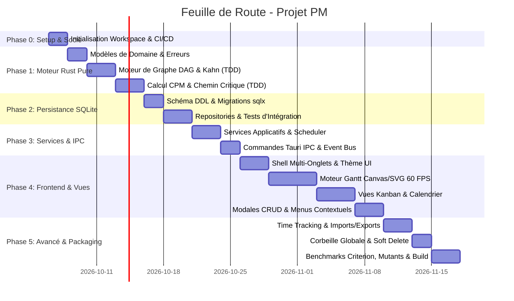

# PLAN DE DÉVELOPPEMENT & FEUILLE DE ROUTE (ROADMAP) : PROJET PM

---

## 1. CADRAGE & MÉTHODOLOGIE D'EXÉCUTION

### 1.1 Objectif
Ce plan de développement structure la réalisation concrète et incrémentale de la plateforme **PM** en s'appuyant strictement sur :
- Le **Cahier des Charges** ([CDC.md](file:///Users/julien.simand/dev%20antigravity/pm/PM/CDC.md)).
- Les **Spécifications Fonctionnelles Détaillées** ([specificationfonctionel.md](file:///Users/julien.simand/dev%20antigravity/pm/PM/specificationfonctionel.md)).
- L'**Architecture Technique Globale** ([archi.md](file:///Users/julien.simand/dev%20antigravity/pm/PM/archi.md)).
- La **Norme de Développement & TDD en Rust** ([normedev.md](file:///Users/julien.simand/dev%20antigravity/pm/PM/normedev.md)).

### 1.2 Principes de Découpage
- **Approche Itérative par Jalons (Milestones) :** Chaque étape produit un composant testé, documenté et opérationnel.
- **TDD Systématique :** Écriture des tests unitaires et de propriétés avant l'implémentation du code métier.
- **Validation Continue :** Exécution du pipeline qualité (`fmt`, `clippy`, `test`, `llvm-cov`) à chaque étape.

---

## 2. VUE D'ENSEMBLE DES PHASES ET JALONS

---

## 3. DÉTAIL OPÉRATIONNEL DES PHASES

### PHASE 0 : Initialisation de l'Environnement & Socle Qualité
* **Objectif :** Poser la structure du projet, les dépendances et les scripts d'assurance qualité.
* **Tâches à réaliser :**
  1. Initialiser le workspace Cargo Rust (`src-tauri/`) et le projet frontend TypeScript/Tauri v2.
  2. Configurer les dépendances clés : `sqlx`, `tokio`, `thiserror`, `serde`, `chrono`, `proptest`, `criterion`, `pretty_assertions`.
  3. Mettre en place la configuration des linters et formatteurs (`rustfmt.toml`, `clippy` strict).
  4. Créer le script de validation locale automatisée (`scripts/check.sh`).
* **Livrables :** Workspace fonctionnel compilant à vide avec suite de tests exécutable via `cargo test`.

---

### PHASE 1 : Moteur de Domaine & Algorithmes de Planification (Rust Core)
* **Objectif :** Développer en TDD pur la logique métier du graphe et le calcul du chemin critique (CPM).
* **Tâches à réaliser :**
  1. **Modèles de Domaine :** Créer les structures `Project`, `Task`, `TaskDependency`, `Member`, `ScheduleResult` avec typage strict.
  2. **Gestion d'Erreurs :** Définir l'énumération `GraphError` avec `thiserror`.
  3. **Moteur DAG & Détection de Cycles (Kahn) :**
     - Écriture des tests unitaires et de propriétés (`proptest`) simulant des graphes complexes et cycliques.
     - Implémentation de l'algorithme de Kahn en $O(V + E)$.
  4. **Moteur CPM (Critical Path Method) :**
     - Écriture des tests de validation des dates au plus tôt ($ES, EF$), au plus tard ($LS, LF$), des marges ($Slack$) et du calcul de la date de fin estimée du projet.
     - Implémentation du Forward Pass et Backward Pass.
     - Identification automatique des arêtes et nœuds critiques.
* **Livrables :** Module `pm-engine` avec 100% de couverture de test et zéro mutant survivant (`cargo-mutants`).

---

### PHASE 2 : Persistance & Repositories SQLite (`sqlx`)
* **Objectif :** Mettre en œuvre la base de données locale transactionnelle et les accès aux données.
* **Tâches à réaliser :**
  1. **Migrations SQL :** Créer le fichier `0001_init_schema.sql` (Tables `projects`, `tasks`, `task_dependencies`, `user_members`, `time_entries`, `project_tab_state`).
  2. **Connexion SQLite :** Configuration du pool `SqlitePool` avec mode WAL et vérification des clés étrangères (`PRAGMA foreign_keys = ON`).
  3. **Repositories CRUD :**
     - `ProjectRepository` (Création, mise à jour, archivage, suppression cascade).
     - `TaskRepository` (Ajout unitaire, batch, modification, suppression logique `is_deleted`).
     - `DependencyRepository` (Liaisons de tâches avec contrainte d'intégrité).
     - `TabStateRepository` (Sauvegarde et restauration de l'état des onglets).
  4. **Tests d'Intégration :** Tests automatisés avec `#[sqlx::test]` validant chaque requête SQL et transaction ACID.
* **Livrables :** Couche de données complète, vérifiée au compile-time par `sqlx`.

---

### PHASE 3 : Services Applicatifs & Commandes Tauri IPC
* **Objectif :** Faire le lien entre le domaine, la persistance et l'interface utilisateur.
* **Tâches à réaliser :**
  1. **`SchedulerService` :** Orchestration du re-calcul CPM à chaque modification de tâche ou de dépendance, avec sauvegarde atomique de la nouvelle date de fin du projet.
  2. **`ProjectService` & `TaskService` :** Cas d'utilisation métiers (Duplication de projet, réassignation, clôture).
  3. **Commandes Tauri IPC :** Exposition des endpoints IPC asynchrones (`get_project_graph`, `update_task_schedule`, `create_dependency`, `save_tab_state`).
  4. **Bus d'Événements Réactifs :** Émission d'événements Tauri lors des mutations pour synchroniser les vues ouvertes.
* **Livrables :** API IPC complète, typée et testée avec simulation de charge.

---

### PHASE 4 : Frontend UI & Moteurs de Vues Réactives (Gantt, Kanban, Calendrier)
* **Objectif :** Construire l'interface utilisateur interactive, moderne et fluide à 60 FPS.
* **Tâches à réaliser :**
  1. **Shell Applicatif & Gestion Multi-Onglets :**
     - Barre d'onglets persistante (ouverture de plusieurs projets en parallèle, réorganisation drag & drop).
     - Thème visuel soigné (Dark/Light mode, polices modernes, micro-animations).
  2. **Moteur du Diagramme de Gantt :**
     - Timeline horizontale virtualisée (zoom Jours / Semaines / Mois).
     - Rendu vectoriel SVG / Canvas 2D pour les flèches de dépendance avec courbes de Bézier.
     - Mise en surbrillance dynamique du chemin critique en rouge.
     - Drag & Drop interactif des barres de tâches et étirement des durées avec mise à jour optimiste.
  3. **Vues Kanban & Calendrier :**
     - Tableau Kanban avec colonnes de statuts configurables et glisser-déposer.
     - Vue Calendrier synchronisée avec affichage des jalons et dates d'échéances.
  4. **Modales d'Édition Complète & Menus Contextuels :**
     - Formulaires complets de création/modification de projets, tâches et intervenants.
     - Menus contextuels clic-droit pour actions rapides.
* **Livrables :** Interface graphique interactive complète connectée au backend Rust.

---

### PHASE 5 : Fonctionnalités Avancées, Imports/Exports & Corbeille
* **Objectif :** Compléter le périmètre fonctionnel étendu décrit dans les spécifications.
* **Tâches à réaliser :**
  1. **Gestion du Temps (Time Tracking) :** Chronomètre en direct sur les tâches et saisie manuelle.
  2. **Moteur d'Import / Export :** Export des plannings en PDF haute résolution, CSV et JSON de sauvegarde ; import de fichiers CSV avec assistant de mapping.
  3. **Corbeille Globale (Trash Center) :** Gestion de la rétention 30 jours, restauration granulaire et purge définitive.
* **Livrables :** Plateforme 100% fonctionnelle conforme à [specificationfonctionel.md](file:///Users/julien.simand/dev%20antigravity/pm/PM/specificationfonctionel.md).

---

### PHASE 6 : Assurance Qualité, Benchmarks de Performance & Packaging
* **Objectif :** Valider la stabilité, les performances extrêmes et produire les exécutables finaux.
* **Tâches à réaliser :**
  1. **Benchmarks Criterion :** Mesurer et garantir un temps de calcul CPM $< 5\text{ms}$ pour $1\,000$ tâches interconnectées.
  2. **Mutation Testing :** Exécution de `cargo mutants` sur le module de graphe pour valider la robustesse des assertions de tests.
  3. **Revue de Couverture Globale :** Vérifier que la couverture de code est $\ge 85\%$ via `cargo llvm-cov`.
  4. **Packaging Multi-Plateforme :** Génération des binaires autonomes Desktop (macOS `.dmg`/`.app`, Linux `.AppImage`, Windows `.msi`).
* **Livrables :** Binaires de production testés, optimisés et prêts au déploiement.

---

## 4. TABLEAU DE BORD DES TÂCHES (WORK BREAKDOWN STRUCTURE - WBS)

| ID | Module / Tâche | Dépendance | Responsable / Rôle | Statut Initial |
| :--- | :--- | :--- | :--- | :---: |
| **DEV-01** | Initialisation Workspace Cargo + Tauri v2 + Outillage CI | - | Lead Dev | 📝 À faire |
| **DEV-02** | Modèles de Domaine Rust & Hiérarchie d'Erreurs (`thiserror`) | DEV-01 | Rust Dev | 📝 À faire |
| **DEV-03** | Algorithme de détection de cycles (Kahn DAG) + Proptests | DEV-02 | Algorithme Dev | 📝 À faire |
| **DEV-04** | Algorithme Critical Path Method (CPM) + Tests de dates | DEV-03 | Algorithme Dev | 📝 À faire |
| **DEV-05** | Schéma SQLite DDL & Migrations embarquées `sqlx` | DEV-01 | Backend Dev | 📝 À faire |
| **DEV-06** | Repositories SQLite (Projets, Tâches, Dépendances, Onglets) | DEV-05 | Backend Dev | 📝 À faire |
| **DEV-07** | SchedulerService (Orchestration recalcul CPM + ACID) | DEV-04, DEV-06 | Backend Dev | 📝 À faire |
| **DEV-08** | Commandes IPC Tauri & Bus d'Événements réactifs | DEV-07 | Backend Dev | 📝 À faire |
| **DEV-09** | Shell UI Desktop + Gestionnaire d'Onglets Multi-projets | DEV-08 | Frontend Dev | 📝 À faire |
| **DEV-10** | Composant Gantt interactif Canvas/SVG + Dépendances Bézier | DEV-09 | Frontend Dev | 📝 À faire |
| **DEV-11** | Vues Kanban & Calendrier synchronisées Drag & Drop | DEV-10 | Frontend Dev | 📝 À faire |
| **DEV-12** | Modales CRUD complètes et Menus contextuels clic-droit | DEV-11 | Frontend Dev | 📝 À faire |
| **DEV-13** | Module Suivi du Temps & Feuilles de temps | DEV-12 | Fullstack Dev | 📝 À faire |
| **DEV-14** | Module Imports / Exports (CSV, JSON, PDF) | DEV-12 | Fullstack Dev | 📝 À faire |
| **DEV-15** | Corbeille Globale, Soft Delete & Rétention 30 jours | DEV-12 | Backend Dev | 📝 À faire |
| **DEV-16** | Benchmarks Criterion & Mutation Testing | DEV-04, DEV-15 | QA / Lead Dev | 📝 À faire |
| **DEV-17** | Packaging et Release des exécutables Desktop | DEV-16 | DevOps / Lead | 📝 À faire |

---

## 5. MATRICE DE GESTION DES RISQUES & PLANS D'ATTÉNUATION

| Risque Identifié | Impact | Probabilité | Plan d'Atténuation |
| :--- | :---: | :---: | :--- |
| **Boucle de dépendance infinie (Cycle)** | Élevé | Faible | Détection préventive $O(V + E)$ en mémoire par l'algorithme de Kahn avant toute validation SQL. |
| **Ralentissement UI sur gros projets (> 500 tâches)** | Moyen | Moyen | Virtualisation du DOM sur le Gantt et tracé vectoriel des liens sur Canvas 2D optimisé. |
| **Conflit de modification concurrente sur les dates** | Moyen | Faible | Transactions SQLite exclusives et recalcul atomique du graphe par le `SchedulerService`. |
| **Régression algorithmique lors d'un refactoring** | Élevé | Faible | Couverture à 100% par tests unitaires et tests basés sur les propriétés (`proptest`). |

---

## 6. CRITÈRES DE SUCCÈS & DEFINITION OF DONE GLOBALE

Le projet sera déclaré achevé et conforme lorsque :
1. L'ensemble des 17 tâches du WBS sont livrées et validées.
2. Toutes les contraintes du [CDC.md](file:///Users/julien.simand/dev%20antigravity/pm/PM/CDC.md) et de [specificationfonctionel.md](file:///Users/julien.simand/dev%20antigravity/pm/PM/specificationfonctionel.md) sont respectées.
3. Le pipeline d'assurance qualité passe avec **zéro warning Clippy**, **100% de tests réussis**, et une couverture globale $\ge 85\%$.
4. L'exécutable desktop démarre instantanément et fonctionne de manière 100% autonome sans serveur distant.
