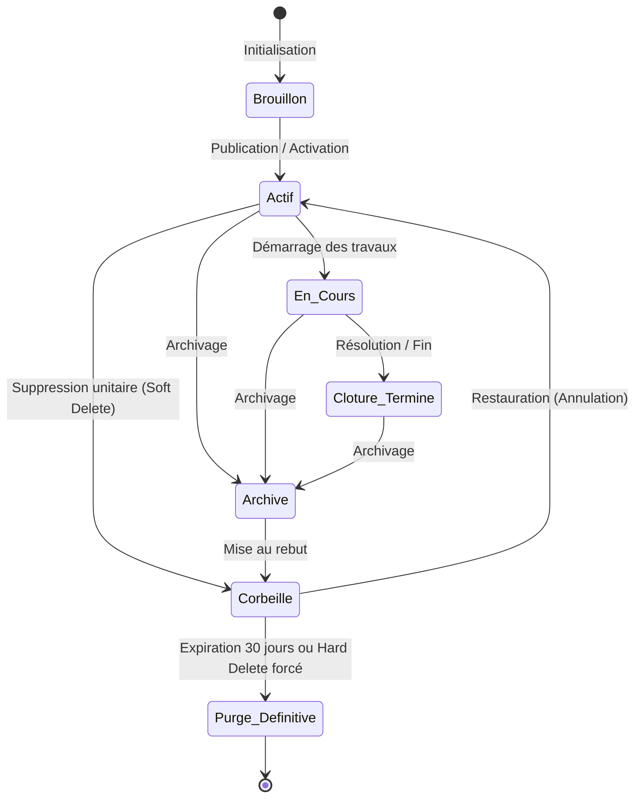
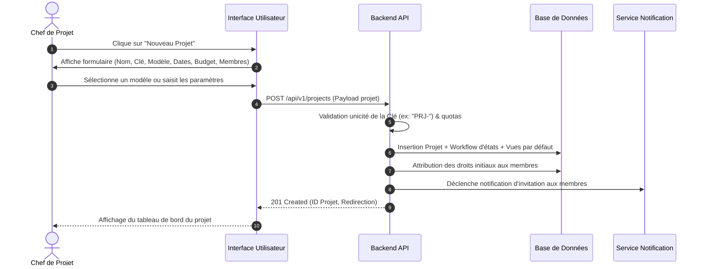
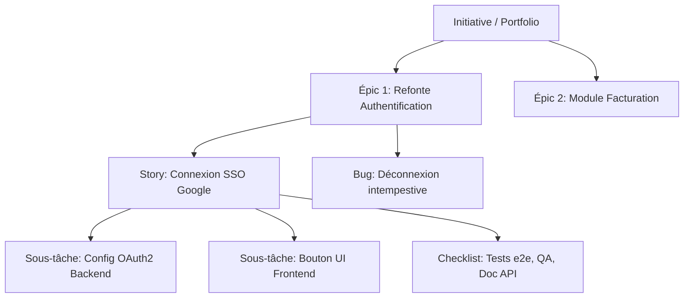
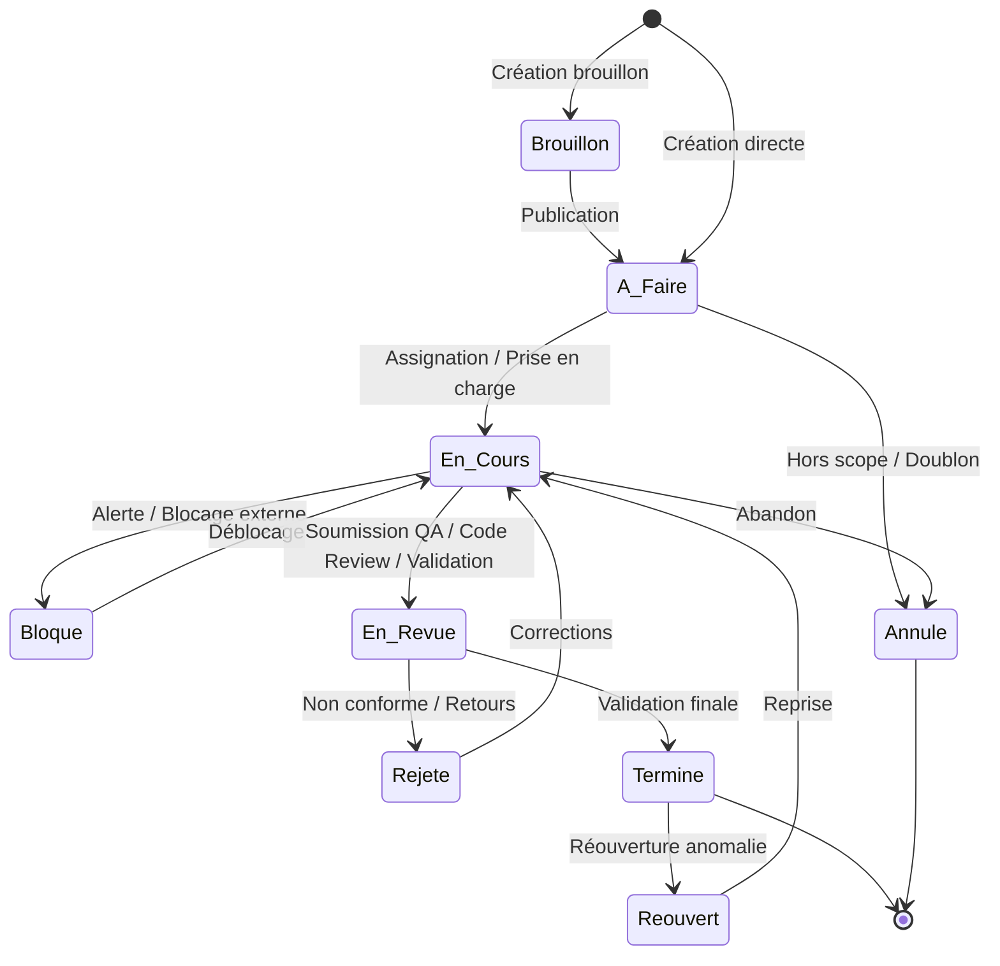
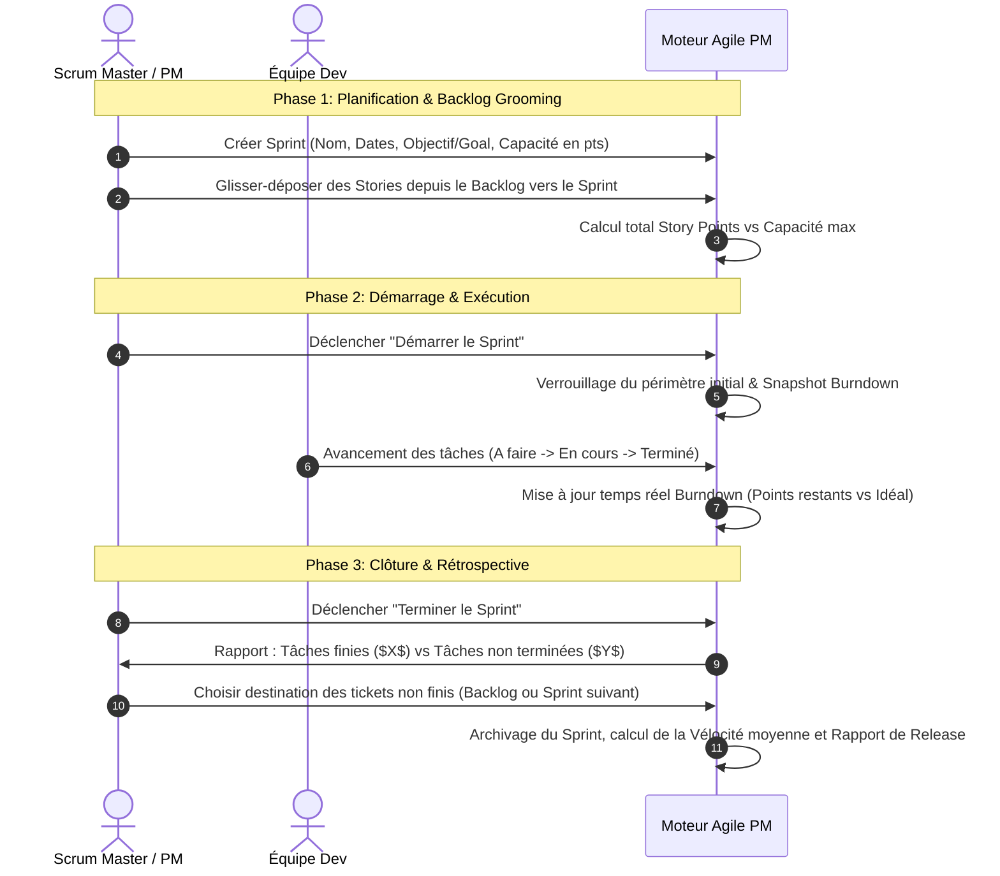
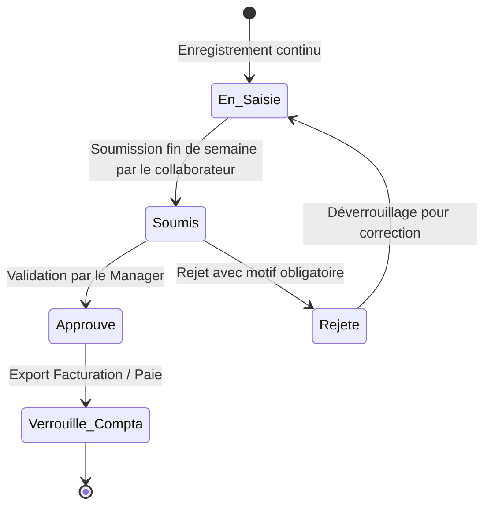
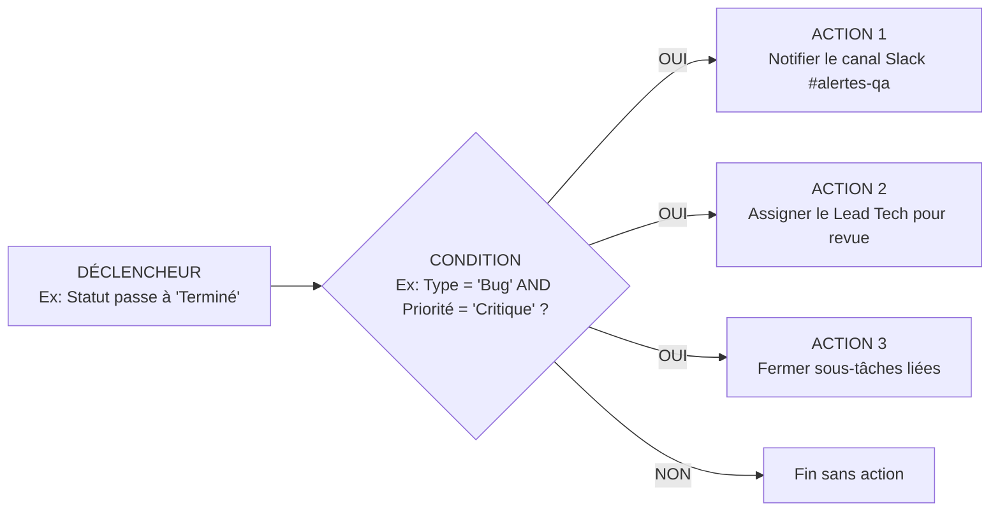

# SPÉCIFICATION FONCTIONNELLE DÉTAILLÉE : PLATEFORME DE GESTION DE PROJETS (PM)

---

## 1. INTRODUCTION & VISION GLOBALE

### 1.1 Objectif du Document
Ce document constitue la **spécification fonctionnelle de référence** de la plateforme de gestion de projet (PM). Il décrit de manière exhaustive, systématique et normée **l'ensemble des workflows, cycles de vie et opérations CRUD** (Création, Lecture/Consultation, Modification, Suppression/Archivage) ainsi que les règles métiers associées, la gestion des permissions et le traitement des cas d'erreur/edge cases.

### 1.2 Typologie des Rôles & Matrice Globale de Droits (RBAC)
Pour l'ensemble des modules décrits ci-dessous, la matrice standard des rôles s'applique :

| Rôle | Périmètre d'Action | Droits Globaux |
| :--- | :--- | :--- |
| **Super-Admin (Platform)** | Plateforme globale / Multi-tenant | Accès absolu, gestion des instances, facturation globale. |
| **Admin d'Organisation / Workspace** | Organisation / Espace de travail | Gestion des membres, configuration globale, suppression de projets, rôles. |
| **Project Manager (Chef de projet)** | Projets assignés | Création/gestion de projet, sprints, jalons, budgets, règles, affectation des tâches. |
| **Membre Équipe (Contributeur)** | Tâches & Projets affectés | Création de tickets/tâches, mise à jour de ses statuts, saisie du temps, commentaires. |
| **Invité / Client (Guest / Viewer)** | Lecture seule ou tickets limités | Consultation restreinte, dépôt de commentaires autorisés, pas de suppression/édition structurelle. |

---

## 2. MODÈLE DE DONNÉES & CYCLE DE VIE UNIFIÉ DES ENTITÉS

### 2.1 Cycle de Vie Universel (Soft Delete & Rétention)
Toute entité principale (Organisation, Projet, Tâche, Document, Sprint) respecte le cycle de vie suivant :

---

## 3. GESTION DES ESPACES DE TRAVAIL (WORKSPACES) & ORGANISATIONS

### 3.1 Création d'un Espace de Travail / Organisation
* **Déclencheur :** Inscription d'un nouveau compte client ou création d'une nouvelle division par un Super-Admin / Admin.
* **Champs obligatoires :** Nom de l'organisation, Slug unique d'URL, Devise par défaut, Fuseau horaire, Email du propriétaire (Owner).
* **Workflow :**
  1. L'utilisateur saisit les informations de base et choisit un plan d'abonnement / quota.
  2. Le système vérifie l'unicité du slug et la validité du domaine.
  3. Création automatique de l'espace avec :
     - 1 projet de bienvenue ("Exemple de projet").
     - Rôles par défaut créés (Admin, Manager, Membre, Invité).
     - Statuts et flux de base initialisés.
  4. Envoi d'un email de confirmation au propriétaire.

### 3.2 Modification d'un Espace de Travail
* **Périmètre modifiable :** Nom, Logo/Branding, Fuseau horaire de travail, Jours et heures ouvrées, Politiques de sécurité (2FA obligatoire, restrictions IP, SSO SAML/OIDC), Champs personnalisés globaux, Intégrations (Slack, GitHub, GitLab, Jira).
* **Règles de gestion (RG) :**
  - La modification du slug entraîne une redirection temporaire de 30 jours des anciennes URLs.
  - La modification des jours ouvrés recalcule dynamiquement les dates d'échéances prévisionnelles des projets en cascade.

### 3.3 Suppression / Archivage d'un Espace de Travail
* **Workflow de désactivation / archivage :**
  1. L'Admin initie la demande de gel de l'organisation.
  2. Verrouillage en lecture seule immédiat pour tous les membres.
  3. Période de grâce de 30 jours avant suppression physique des données.
* **Workflow de suppression définitive (Hard Delete / Droit à l'oubli RGPD) :**
  1. Double authentification requise (saisie du mot de passe + code 2FA + confirmation par saisie explicite du nom de l'organisation).
  2. Déconnexion immédiate de toutes les sessions actives.
  3. Purge complète en cascade : Projets, Tâches, Pièces jointes (S3/GCS), Historique, Commentaires, Facturation.
  4. Envoi d'un certificat de suppression et d'export de données JSON/ZIP par email au propriétaire.

---

## 4. GESTION DES PROJETS

### 4.1 Types de Projets Supportés
* **Scrum / Agile :** Orienté Sprints, Backlog, Vélocité, Story Points, Burndown charts.
* **Kanban :** Orienté flux continu, Limites WIP (Work In Progress), Cycle time / Lead time.
* **Cascade / Waterfall / Gantt :** Orienté phases séquentielles, dépendances strictes, chemin critique, jalons.
* **Hybride / Gestion de tâches générique :** Adaptable à toutes équipes (Marketing, RH, Opérations).

### 4.2 Workflow de Création de Projet

#### Règles de Gestion (Création) :
- **Clé de projet :** Code alpha-numérique de 2 à 10 caractères (ex: `ALPHA`), servant de préfixe unique aux tickets (`ALPHA-1`, `ALPHA-2`).
- **Templates :** Possibilité de dupliquer un projet existant avec sélection granulaire des éléments à copier (Structure seule, Tâches modèles, Membres, Vues, Automatisations).
- **Import externe :** Assistants d'import direct depuis Jira (backup XML/JSON), Trello (JSON), Asana (CSV/API), Monday.com.

### 4.3 Modification de Projet
* **Édition des métadonnées :** Titre, Description, Objectifs stratégiques (OKRs), Catégorie, Priorité.
* **Gestion budgétaire & Coûts :**
  - Budget financier global alloué.
  - Seuil d'alerte de dépassement (ex: alerte email/push à 80% et 100%).
  - Taux horaire par défaut du projet ou par membre.
* **Paramétrage des états & colonnes :**
  - Ajout/renommage/suppression d'états de workflow.
  - Définition des règles de transition obligatoires (ex: passage à "Terminé" requiert la complétion de 100% des sous-tâches).
* **Gestion des Membres & Permissions :**
  - Ajout d'utilisateurs ou d'équipes entières avec rôle spécifique au projet.
  - Retrait d'un membre : proposition automatique de réassignation de ses tickets ouverts.

### 4.4 Clôture, Archivage et Suppression de Projet
1. **Clôture :** Marque le projet comme terminé. Aucune nouvelle tâche ne peut être créée sans réouverture formelle.
2. **Archivage :**
   - Projet masqué des listes courantes et des menus de navigation rapides.
   - Données conservées pour reporting et audit historique.
   - Réactivation en 1 clic possible par un Admin.
3. **Suppression (Corbeille & Purge) :**
   - Mise en corbeille (Soft Delete) : Récupérable pendant 30 jours.
   - Suppression définitive (Hard Delete) : Requiert l'autorisation Admin. Alerte sur le nombre de tâches/documents qui seront détruits.

---

## 5. MOTEUR CENTRAL DES TÂCHES & TICKETS (ISSUES ENGINE)

### 5.1 Hiérarchie & Typologie des Tâches
La plateforme prend en charge une hiérarchie stricte à 5 niveaux :
1. **Portfolio / Initiative :** Regroupement de projets stratégiques.
2. **Épic / Jalon Majeur :** Grande fonctionnalité ou objectif projet.
3. **Tâche / User Story / Bug :** Unité de travail standard autonome.
4. **Sous-tâche :** Découpage technique ou opérationnel d'une tâche parente.
5. **Checklist Item :** Éléments de vérification atomiques (cases à cocher).

### 5.2 Cycle de Vie & Workflow d'États d'une Tâche
Chaque tâche suit une machine à états finis configurable :

### 5.3 Workflows de Création de Tâche
* **Création Standard :** Formulaire complet modal avec titre, description riche (WYSIWYG/Markdown), type, priorité (Basse, Normale, Haute, Urgente, Bloquante), assigné(s), rapporteur, dates (début, échéance), estimation (Story points / Heures), étiquettes (tags), jalons, pièces jointes.
* **Création Rapide (Inline Quick Add) :** Ajout d'une ligne dans les vues Liste ou Kanban avec validation par "Entrée" (Titre seul, métadonnées héritées par défaut).
* **Création par Email (Email-to-Task) :**
  - Chaque projet dispose d'une adresse email dédiée (`inbound+proj-id-xyz@app.pm.com`).
  - L'objet devient le titre de la tâche, le corps devient la description, les pièces jointes sont automatiquement uploadées.
* **Création par Formulaire Public / Portail Client :**
  - Formulaires d'assistance ou de demande fonctionnelle sans compte obligatoire.
  - Conversion automatique en ticket avec statut "À trier".
* **Création par Duplication / Modèle de Tâche :**
  - Duplication complète avec choix de copier les sous-tâches, pièces jointes et commentaires.
  - Utilisation de modèles de tâches préconfigurés (ex: "Bug Template", "Onboarding Collaborateur").

### 5.4 Workflows de Modification de Tâche
1. **Édition Unitaire & Temps Réel :**
   - Mise à jour instantanée champ par champ avec verrouillage optimiste / synchronisation WebSocket.
   - Indicateur de présence (voir qui consulte ou édite la tâche en même temps pour éviter les conflits).
2. **Multi-Édition en Masse (Bulk Actions) :**
   - Sélection multiple de $N$ tâches depuis une vue tableau ou liste.
   - Actions groupées : Réassignation, changement de statut, modification d'échéance (+/- $X$ jours), ajout de tags, déplacement vers un autre projet/sprint, suppression groupée.
3. **Dépendances & Relations Inter-Tâches :**
   - **Types de liens :** "Bloque / Est bloqué par", "Est lié à", "Est un doublon de / Dupliqué par", "Parent de / Enfant de".
   - **Règle bloquante (Strict Gating) :** Empêcher le passage d'une tâche à "En cours" ou "Terminé" si ses tâches bloquantes ne sont pas clôturées.
4. **Conversion de Types & Restructuration :**
   - Transformer une tâche en sous-tâche d'une autre tâche.
   - Promouvoir une sous-tâche au rang de tâche indépendante ou d'Épic.
   - Déplacer une tâche vers un autre projet (avec mapping automatique des statuts et champs personnalisés correspondants).

### 5.5 Workflows de Suppression & Corbeille de Tâche
* **Mise à la corbeille unitaire / multiple :**
  - La tâche disparaît des tableaux actifs et des calculs de vélocité.
  - Ses sous-tâches et pièces jointes sont également marquées en corbeille en cascade.
* **Restauration :**
  - Restaure la tâche dans son projet et statut d'origine (ou statut par défaut si le statut précédent a été supprimé).
  - Restaure automatiquement l'arborescence des sous-tâches liées.
* **Purge Définitive :**
  - Suppression physique de la base de données et suppression des fichiers attachés sur le stockage objet.

---

## 6. MOTEUR DES VUES & RESTITUTION VISUELLE

### 6.1 Catalogue des Vues Prises en Charge
| Type de Vue | Usage Principal | Fonctionnalités Clés |
| :--- | :--- | :--- |
| **Kanban** | Visualisation du flux & Limites WIP | Glisser-déposer de colonnes/cartes, colonnes combinées, swimlanes par assigné/priorité/épic. |
| **Liste / Tableau Hiérarchique** | Gestion détaillée et rapide | Dépliage arborescent (Épic > Tâche > Sous-tâche), édition tableur inline. |
| **Gantt / Timeline** | Planification temporelle & Dépendances | Liens de dépendance étirables à la souris, chemin critique automatique, zoom (Jours/Semaines/Mois/Trimestres). |
| **Calendrier** | Vue par échéances et livrables | Vues Mois/Semaine/Jour, synchronisation iCal / Google Calendar / Outlook. |
| **Tableau Croisé / Grille (Spreadsheet)** | Saisie de masse & Custom Fields | Tri multicritères, colonnes redimensionnables et épinglables, calculs automatiques (sommes, moyennes). |
| **Charge de Travail (Workload)** | Capacité et équilibrage des ressources | Heatmap de surcharge/sous-charge par collaborateur par jour/semaine. |
| **Cartographie Mentale (Mindmap)** | Brainstorming et cadrage initial | Arborescence libre transformable en projet/tâches d'un clic. |

### 6.2 Workflows de Gestion des Vues
* **Création d'une Vue :**
  - Choix du type de vue.
  - Définition des filtres combinés avancés avec logique booléenne `(Statut IN ['En cours', 'QA'] AND Priorité = 'Haute') OR Assigné = @me`.
  - Configuration de la visibilité : "Vue Privée" (visible uniquement par le créateur), "Vue Équipe / Projet" (partagée), "Vue Verrouillée" (non modifiable par les membres).
* **Modification & Sauvegarde :**
  - Mémorisation automatique de l'état (colonnes masquées, tris, filtres actifs).
  - Export instantané au format PDF haute résolution, PNG, Excel (XLSX) ou CSV.
* **Suppression de Vue :**
  - Suppression sans aucun impact sur les données sous-jacentes des tâches.

---

## 7. GESTION DES MÉTHODOLOGIES AGILES (SPRINTS, BACKLOG & RELEASES)

### 7.1 Cycle de Vie d'un Sprint

### 7.2 Règles Métier des Sprints & Releases
* **Sprint Actif Unique :** Par défaut, un seul sprint actif par tableau (option multi-sprints parallèles activable pour les grandes équipes).
* **Scope Creep Tracking :** Tout ajout de ticket dans un sprint déjà démarré est tagué avec l'indicateur "Ajouté après lancement" pour analyser les dérives de périmètre.
* **Gestion des Versions / Releases :**
  - Regroupement de tickets sous un jalon de version (ex: `v2.4.0`).
  - Génération automatique des Changelogs et Release Notes à partir des descriptions des tickets clôturés.

---

## 8. SUIVI DU TEMPS, FEUILLES DE TEMPS (TIMESHEETS) & FACTURATION

### 8.1 Modes de Saisie du Temps (Création)
1. **Chronomètre en Direct (Live Timer) :**
   - Bouton "Play/Pause" sur la tâche ou dans la barre d'outils globale.
   - Détection d'inactivité (Idle detection) : proposition de conserver ou déduire le temps en cas d'absence prolongée.
2. **Saisie Manuelle sur Tâche :**
   - Saisie de la durée (ex: `1h 30m` ou `1.5`), date, catégorie d'activité (Développement, Réunion, Design, Test), statut facturable/non facturable, description des travaux.
3. **Feuille de Temps Hebdomadaire (Weekly Timesheet Grid) :**
   - Matrice Lignes (Projets/Tâches) $\times$ Colonnes (Jours de la semaine).
   - Remplissage rapide et calcul automatique des totaux journaliers et hebdomadaires.

### 8.2 Workflow d'Approbation des Feuilles de Temps

#### Règles de Gestion (Temps) :
- Une entrée de temps approuvée ou rattachée à une période clôturée ne peut plus être modifiée ni supprimée sans réouverture explicite par un Admin.
- Alerte si un collaborateur saisit plus de la limite quotidienne légale configurée (ex: > 10h/jour).

---

## 9. DOCUMENTS, WIKI & BASE DE CONNAISSANCES

### 9.1 Création et Édition Collaborative
* **Éditeur de documents :** Support Markdown enrichi, blocs interactifs (tableaux, intégration directe de listes de tâches dynamiques, diagrammes Mermaid, embeds Figma/YouTube).
* **Édition temps réel (CRDT / Operational Transformation) :** Curseurs multiples en direct, co-écriture instantanée.
* **Gestion des Versions & Historique :**
  - Sauvegarde automatique continue de snapshots.
  - Visualisation comparative (Diff visuel côte à côte / Ajouts en vert, Suppressions en rouge).
  - Possibilité de restaurer n'importe quelle version antérieure en 1 clic.

### 9.2 Gestion des Fichiers et Pièces Jointes
* **Upload :** Drag & drop, collage depuis le presse-papier (screenshots), multi-upload avec barre de progression.
* **Versioning de fichiers :** Upload d'un fichier portant le même nom crée automatiquement la version $v2, v3$ en conservant l'accès aux versions antérieures.
* **Sécurité & Contrôle :** Analyse antivirus à la volée, génération de miniatures sécurisées, restrictions sur les types de fichiers exécutables (`.exe`, `.sh`).

---

## 10. COLLABORATION, COMMENTAIRES & AUDIT TRAIL

### 10.1 Workflows des Commentaires & Fils de Discussion (Threads)
* **Création :**
  - Saisie de texte avec mentions `@utilisateur` (avec notification instantanée), mentions de tâches `#PROJ-123` (avec backlink automatique), émojis, pièces jointes.
  - Possibilité de répondre directement sous forme de fil (Thread) pour éviter de polluer la conversation principale.
* **Modification :**
  - Seul l'auteur ou un Super-Admin peut modifier un commentaire.
  - Mention explicite de modification affichée : *(modifié le 06/10/2026 à 14:30)* avec historique des modifications accessible.
* **Suppression :**
  - Remplacement du contenu par la mention *"Ce message a été supprimé par l'auteur"* pour conserver la cohérence du fil de discussion (Soft delete).

### 10.2 Journal d'Audit & Traçabilité (Activity Stream)
* Enregistrement immuable de chaque action :
  `[Timestamp] [Utilisateur ID] a changé [Champ] de [Ancienne Valeur] à [Nouvelle Valeur] sur [Entité]`.
* Filtres de recherche dans l'historique par date, auteur, type d'action (création, changement de statut, suppression).

---

## 11. MOTEUR D'AUTOMATISATION & RÈGLES MÉTIER (NO-CODE)

### 11.1 Architecture Déclencheur - Condition - Action (ECA)
Chaque règle d'automatisation est construite selon le paradigme :
$$\text{TRIGGER} \longrightarrow \text{CONDITIONS (Filtres)} \longrightarrow \text{ACTIONS}$$

### 11.2 Catalogue des Événements & Actions
* **Déclencheurs (Triggers) :**
  - Création d'une tâche / commentaire / projet.
  - Modification d'un champ spécifique (Statut, Priorité, Échéance, Assigné).
  - Échéance approchante (ex: 24h avant l'échéance).
  - Déclencheur planifié (ex: tous les lundis à 09h00).
  - Webhook entrant depuis un service externe (GitHub, GitLab, Stripe).
* **Actions :**
  - Mettre à jour des champs de la tâche ou de la tâche parente.
  - Déplacer vers un autre sprint / projet.
  - Créer des sous-tâches modèles automatiquement.
  - Envoyer une notification personnalisée (Email, Slack, MS Teams, In-App).
  - Déclencher un Webhook sortant / Appel API HTTP REST.

### 11.3 Gestion du Cycle de Vie des Règles
* **Création :** Interface visuelle no-code avec validation syntaxique en temps réel.
* **Test & Bac à sable (Dry-Run) :** Exécution simulée sur un ticket d'exemple sans appliquer les changements.
* **Activation / Pause :** Bascule On/Off instantanée.
* **Logs & Monitoring :** Journal détaillé des exécutions (Succès, Échecs, Durée, Payload) avec alertes en cas d'erreurs répétées.
* **Protection anti-boucle infinie :** Détection automatique des cascades récursives et coupure de sécurité à 10 exécutions imbriquées.

---

## 12. GESTION DES NOTIFICATIONS & PRÉFÉRENCES

### 12.1 Canaux & Matrice de Déclenchement
* **Canaux disponibles :**
  1. Centre de notifications In-App (cloche temps réel avec WebSocket).
  2. Emails transactionnels & Résumés quotidiens (Daily Digest).
  3. Notifications Push Web & Mobile.
  4. Intégrations externes directes (Slack, Microsoft Teams, Discord).

### 12.2 Centre de Contrôle des Notifications
* **Actions Utilisateur :**
  - Marquer comme lu / tout marquer comme lu.
  - Mettre en sommeil (Snooze) : réapparaît dans 1h, demain ou à une date choisie.
  - Filtrage par type : Mentions directes (@moi), Tâches assignées, Alertes système.
  - Paramétrage granulaire des préférences par projet (Mode "Tous les événements", "Mentions uniquement", "Muet").

---

## 13. GESTION DES RESSOURCES, CAPACITÉS & CONGÉS

### 13.1 Modélisation des Ressources
* Profil de compétences, fuseau horaire, quotité de travail (ex: 100%, 80%, 50%).
* Gestion des congés et jours fériés avec intégration sur le calendrier de planification.

### 13.2 Workflows d'Équilibrage de Charge
* Détection automatique des surcharges : dépassement des heures maximales par semaine.
* Nivellement assisté des ressources : décalage automatique des tâches non critiques pour lisser la charge sur le calendrier Gantt.

---

## 14. IMPORTS, EXPORTS & GESTION DE LA CORBEILLE GLOBALE

### 14.1 Matrice Récapitulative des Imports / Exports

| Format / Source | Sens | Périmètre | Mécanisme de Résolution des Conflits |
| :--- | :---: | :--- | :--- |
| **CSV / XLSX** | Import & Export | Tâches, Utilisateurs, Temps, Projets | Écran de mapping interactif des colonnes + Prévisualisation des erreurs. |
| **Jira / Trello / Asana** | Import | Projets complets, Sprints, Tickets, Pièces jointes | Migration automatique avec mapping des utilisateurs existants ou création d'utilisateurs fantômes. |
| **JSON / API REST** | Import & Export | Sauvegarde intégrale de l'espace de travail | Validation par Schéma JSON Schema strict. |
| **PDF / PNG** | Export | Diagrammes de Gantt, Rapports de synthèse, Vues Kanban | Moteur de rendu vectoriel haute fidélité. |

### 14.2 Tableau de Bord de la Corbeille (Trash Center)
* **Vue centralisée :** Liste de tous les objets supprimés (Projets, Tâches, Fichiers, Documents) avec nom de l'auteur de la suppression et date de suppression.
* **Rétention automatique :** Purge automatique et irréversible après **30 jours calendaires**.
* **Restauration granulaire :** Restauration d'un élément parent ou d'un élément enfant isolé.

---

## 15. GESTION DES CONFLITS & RÈGLES DE CONCURRENCE

1. **Optimistic Locking (Verrouillage Optimiste) :**
   - Chaque modification transmet le numéro de version de l'entité (`version_id`).
   - Si un autre utilisateur a soumis une modification entre-temps, l'API renvoie un code `409 Conflict` avec un écran de fusion visuelle (choix entre écraser, recharger ou fusionner champ par champ).
2. **Synchronisation Collaborative en Direct :**
   - Utilisation de WebSockets pour diffuser les mises à jour aux clients connectés en moins de 100ms.
   - Verrouillage éphémère de champ lors de la saisie (ex: "Julien est en train de modifier ce champ...").

---

## 16. CONCLUSION & MATRICE D'EXCELLENCE
Ce document couvre la totalité des interactions requises pour une plateforme de gestion de projet moderne et résiliente. Chaque nouveau module ou développement devra se conformer strictement aux cycles de vie, matrices de permissions et règles de suppression en cascade définies dans cette spécification.
